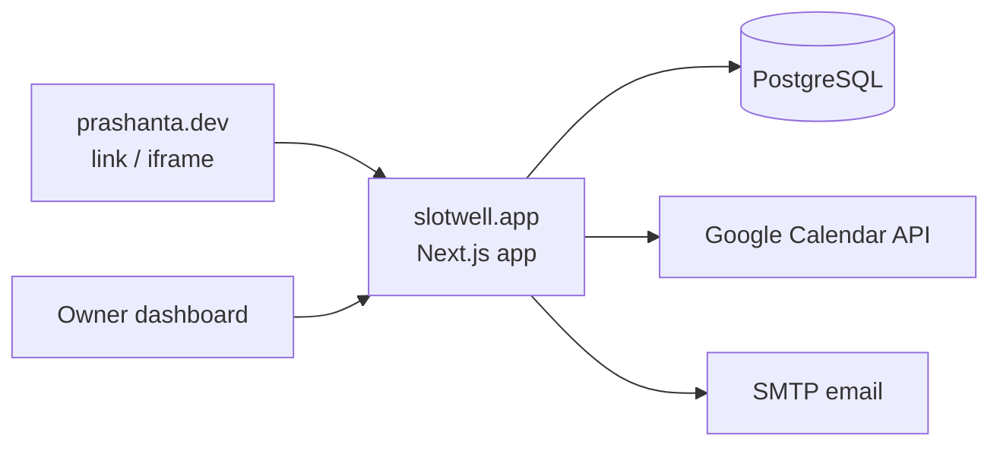
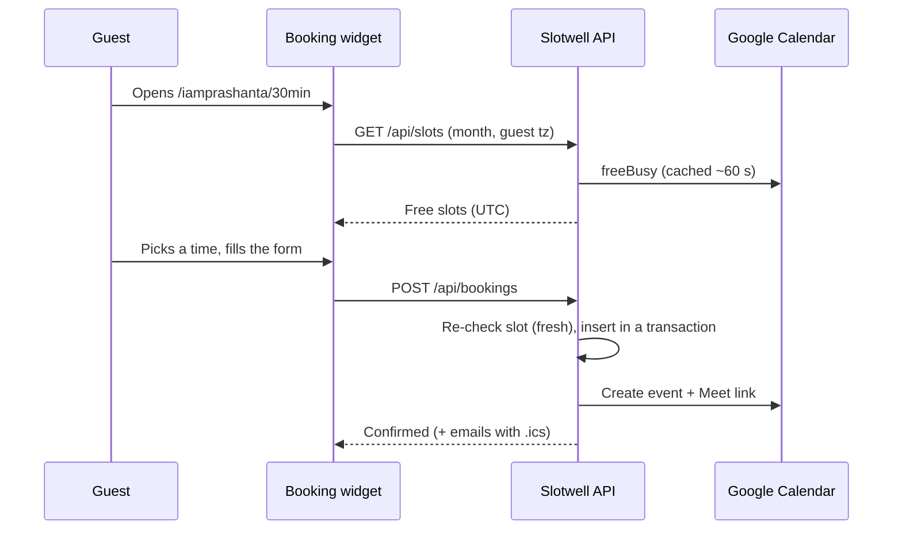

# Architecture

Slotwell is one Next.js app backed by one PostgreSQL database. Scheduling logic, secrets and data stay in this app; host sites (like prashanta.dev) only link to it or embed `/embed/*` pages.



## Folder layout

```text
server/                 Plain Node modules shared by the app and CLI scripts
  db.mjs                pg connection pool
  auth.mjs              Better Auth: Google-only, locked to OWNER_EMAIL, seeds defaults on first sign-in
  migrate.mjs           Applies Better Auth schema, then migrations/*.sql once each
  migrations/           Numbered SQL files (never edit an applied one)
src/
  app/                  Routes (pages + API route handlers)
  components/           UI (booking widget, brand, buttons, auth)
  lib/availability/     Pure slot engine + time-zone helpers (tested, no dependencies)
  lib/booking-schema.ts Zod schemas for booking and cancel requests
  lib/ics.ts            RFC 5545 invite builder (tested)
  server/               Server-only code: bookings, data access, Google Calendar, email, rate limits, sessions
scripts/                db-smoke-test.mjs (npm run test:db)
docs/                   Project documentation
deploy/                 Example systemd unit and Nginx site for the production server
```

## Booking flow



## Availability engine

`src/lib/availability/engine.ts` is a pure function: weekly rules + date overrides + busy intervals + event rules → slots.

1. Expand the owner's weekly hours and overrides into windows for each local date (owner's time zone, DST-safe via `Intl`).
2. Step through each window every `slot_interval_min`, keeping slots that fit `duration_min`.
3. Drop slots before now + minimum notice or beyond max days ahead.
4. Drop slots overlapping calendar busy time (widened by this event's buffers) or existing bookings (whose `blocked` range already includes their buffers).
5. Apply the daily limit.

Slots are returned as UTC instants; the browser formats them in the guest's zone. Tests: `npm test`.

## Data model

See `server/migrations/001_init.sql`. Tables: `owner_settings`, `event_types`, `availability_rules`, `date_overrides`, `bookings`, plus Better Auth's `user`, `session`, `account`, `verification`, `rateLimit`.

Double-booking protection: `bookings_no_overlap` is an exclusion constraint on `(owner_id, blocked)` for confirmed bookings, so two concurrent requests for the same time cannot both succeed.

## Security

- Only the Google account in `OWNER_EMAIL` can create a user; everyone else is rejected at sign-up.
- OAuth tokens are encrypted in the database (`encryptOAuthTokens`).
- Pages send a strict CSP; only `/embed/*` may be framed, and only by `EMBED_ALLOWED_ORIGINS`.
- Guest manage links store only a SHA-256 hash of their token.
- All API input is validated with Zod; the booking form has a honeypot field; public endpoints are rate-limited per IP (in memory — Slotwell runs as one process).
- Pages that carry a manage token in the URL send `Referrer-Policy: no-referrer`.
- Google and email failures never undo a saved booking: Google errors are stored in `bookings.sync_error`, email errors are logged.
- Reserved usernames: `api`, `login`, `dashboard`, `embed`, `booking` are real routes and win over `/{username}`.
